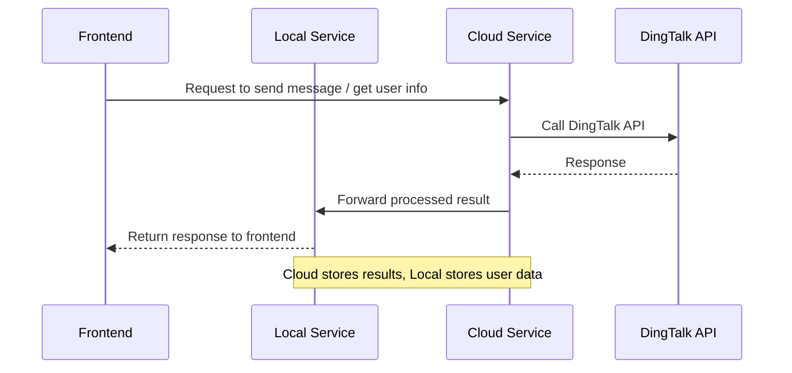

# DingTalkOAuth

A FastAPI-based OAuth2.0 authentication and messaging integration for **Alibaba DingTalk**, supporting both **cloud** and **local** deployment modes.

## 🔧 Features

- **Message Sending**: Call DingTalk APIs to send messages to users in an enterprise.
- **User Info Retrieval**: Fetch user info from an authorized enterprise using DingTalk APIs.
- **OAuth2.0 Authentication**: Support for third-party login and user identity retrieval.

## 🧠 Architecture Overview

To support **multiple environments** and **network-isolated local deployments**, this project separates into two coordinated modules:

### ☁️ Cloud Deployment (`DeployMode.CLOUD`)

- Uses **SQLite** for lightweight persistent storage.
- Must be **accessible from the public internet**.
- Responsible for:
  - Sending requests to DingTalk servers (e.g., send message, get user info).
  - Returning results to the local service.

### 🖥️ Local Deployment (`DeployMode.LOCAL`)

- Uses **PostgreSQL** for local storage.
- Must be able to **access the cloud service** and receive responses.
- Receives data from the cloud and stores user-related information locally.

## 🌐 Request Flow



### Project Structure

```
.
├── router/
│   ├── cloud/      # Cloud-side API endpoints
│   └── local/      # Local-side API endpoints
├── core/
├── schema/
├── main.py
```

## 🔑 Key Concepts

- **CorpId**: Unique identifier for an enterprise on DingTalk.
- **SuiteKey / SuiteSecret**: Credentials used by third-party enterprise apps.
- **AgentId**: Unique ID for each app authorized by the enterprise.

## 🔄 Authentication Flow

- Follows **OAuth2.0 authorization code flow**.
- Redirects users to DingTalk for login and consent.
- After authorization, retrieves the `access_token` and user info from DingTalk servers.

## 📚 Reference

For full integration details, refer to [Alibaba DingTalk Open Platform Docs (EN)](https://open.dingtalk.com/document/orgapp-server/introduction).

## 📦 Tech Stack

- **FastAPI** – Web framework
- **SQLite / PostgreSQL** – Storage backend for cloud and local modes
- **Pydantic** – Data validation
- **Uvicorn** – ASGI server
