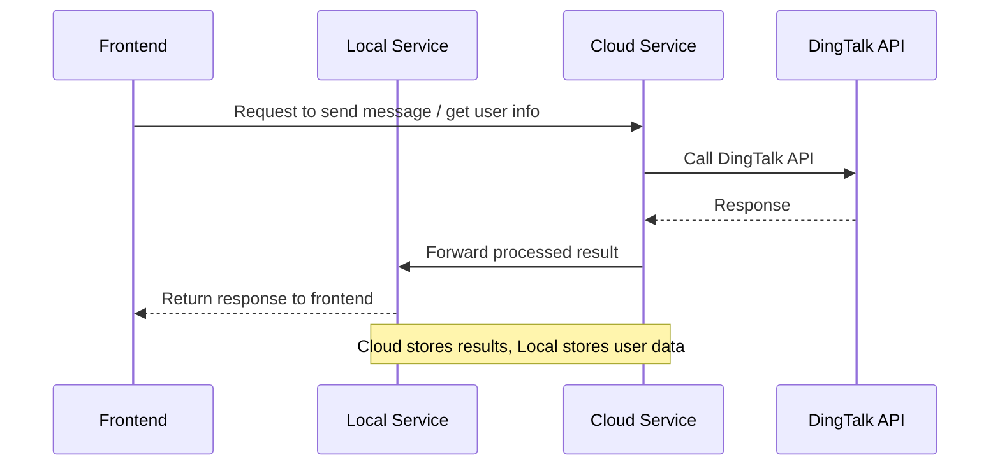

# DingTalkOAuth

A FastAPI-based OAuth2.0 authentication and messaging integration for **Alibaba DingTalk**, supporting both **cloud** and **local** deployment modes.

This repository is a backend integration example that focuses on a practical boundary: the public cloud service can talk to DingTalk, while a local deployment can keep internal user data and enterprise systems inside a protected network.

## 🔧 Features

- **Message Sending**: Call DingTalk APIs to send messages to users in an enterprise.
- **User Info Retrieval**: Fetch user info from an authorized enterprise using DingTalk APIs.
- **OAuth2.0 Authentication**: Support for third-party login and user identity retrieval.
- **Deployment Separation**: Split cloud-facing API calls from local persistence and enterprise-system coordination.

## 🧠 Architecture Overview

To support **multiple environments** and **network-isolated local deployments**, this project separates into two coordinated modules:

### ☁️ Cloud Deployment (`DeployMode.CLOUD`)

- Uses **SQLite** for lightweight persistent storage.
- Must be **accessible from the public internet**.
- Responsible for:
  - Sending requests to DingTalk servers (e.g., send message, get user info).
  - Returning results to the local service.

### 🖥️ Local Deployment (`DeployMode.LOCAL`)

- Uses **PostgreSQL** for local storage.
- Must be able to **access the cloud service** and receive responses.
- Receives data from the cloud and stores user-related information locally.

## 🌐 Request Flow


```mermaid
sequenceDiagram
    participant FE as Frontend
    participant Local as Local Service
    participant Cloud as Cloud Service
    participant DingTalk as DingTalk API

    FE->>Cloud: Request to send message / get user info
    Cloud->>DingTalk: Call DingTalk API
    DingTalk-->>Cloud: Response
    Cloud->>Local: Forward processed result
    Local-->>FE: Return response to frontend

    Note over Cloud,Local: Cloud stores results, Local stores user data
```

### Project Structure

```
.
├── router/
│   ├── cloud/      # Cloud-side API endpoints
│   └── local/      # Local-side API endpoints
├── core/
├── schema/
├── main.py
```

## 🔑 Key Concepts

- **CorpId**: Unique identifier for an enterprise on DingTalk.
- **SuiteKey / SuiteSecret**: Credentials used by third-party enterprise apps.
- **AgentId**: Unique ID for each app authorized by the enterprise.

## ⚙️ Configuration

Runtime configuration is loaded from environment variables or a local `.env` file through `settings.py`.

Important settings include:

- `database_url`: PostgreSQL connection string for local storage.
- `sqlite_database_url`: SQLite database path for cloud mode.
- `dingding_aes_key`, `dingding_token`, `dingding_suit_key`, `dingding_suite_secret`: DingTalk app credentials.
- `dingding_deploy_mode`: `CLOUD`, `LOCAL`, or `DEV_DEBUG`.
- `dingding_cloud_host`: public cloud service URL used by local deployments.
- `dingding_secret_user`, `dingding_secret_password`: basic-auth credentials for protected internal calls.

Do not commit real DingTalk credentials or production database URLs.

## 🚀 Run

Install dependencies, provide configuration, and start the ASGI server:

```bash
python -m venv .venv
source .venv/bin/activate
pip install -r requirements.txt

cp .env.example .env  # if you maintain one locally
python main.py
```

The service starts on `0.0.0.0:8000` by default.

## 🔄 Authentication Flow

- Follows **OAuth2.0 authorization code flow**.
- Redirects users to DingTalk for login and consent.
- After authorization, retrieves the `access_token` and user info from DingTalk servers.

## 📚 Reference

For full integration details, refer to [Alibaba DingTalk Open Platform Docs (EN)](https://open.dingtalk.com/document/orgapp-server/introduction).

## 📦 Tech Stack

- **FastAPI** – Web framework
- **SQLite / PostgreSQL** – Storage backend for cloud and local modes
- **Pydantic** – Data validation
- **Uvicorn** – ASGI server

## Engineering Focus

This project is useful as a reference for:

- separating public API callbacks from internal persistence
- modeling deployment modes explicitly instead of relying on scattered conditionals
- wrapping third-party enterprise APIs behind a local service boundary
- keeping authentication, messaging, and storage responsibilities visible in the architecture
